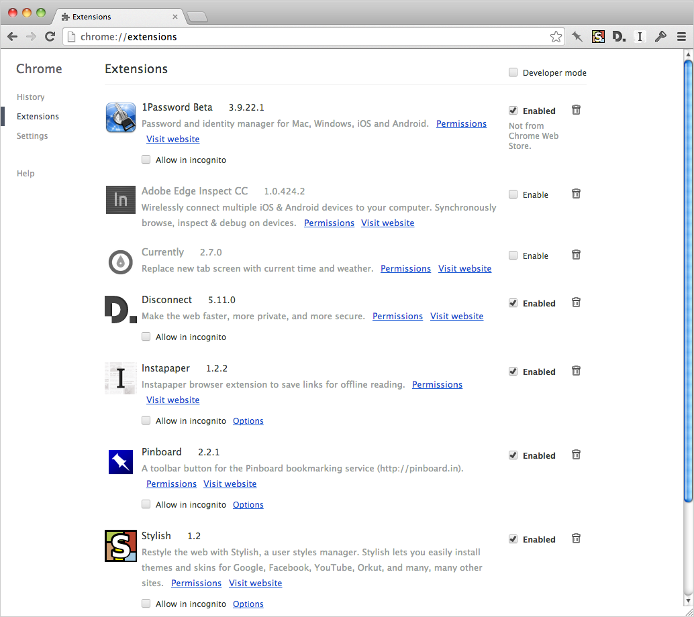
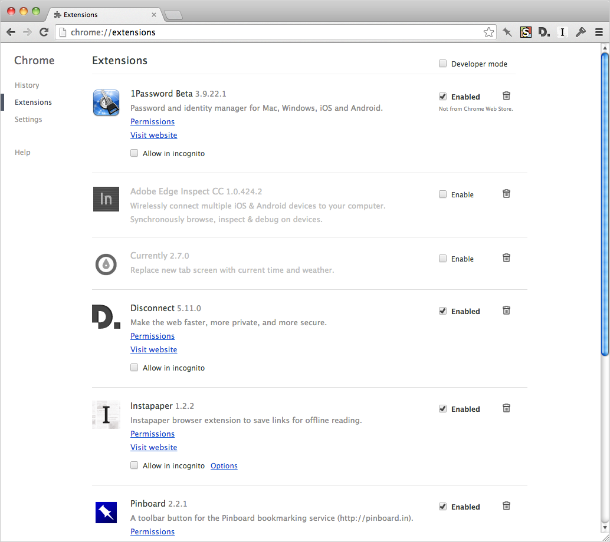

# Chrome Extensions Page Tidy

A user stylesheet that brings the shiny to the [Chrome Extensions](https://support.google.com/chrome/answer/187443) page.

Copy the styles to the `Custom.css` file found in one of the following locations.

#### Mac OS X
`~/Library/Application Support/Google/Chrome/Default/User StyleSheets/`

#### Windows 7 & 8
`\AppData\Local\Google\Chrome\User Data\Default\User StyleSheets\`

#### Linux
`~/.config/google-chrome/Default/User StyleSheets/`

## Before

## After

